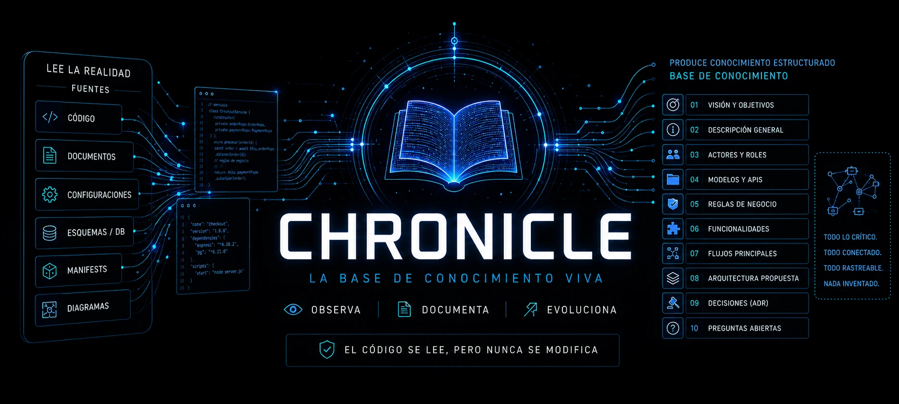
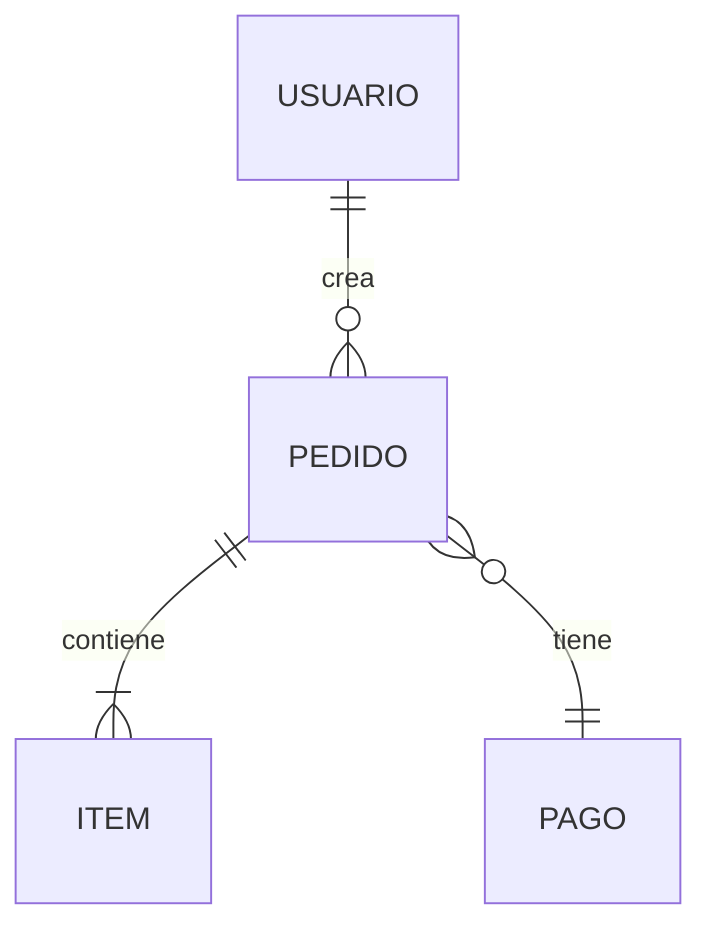

<div align="center">



# chronicle

**La crónica viva de tu proyecto.** Una skill que construye y mantiene una base de conocimiento estructurada — desde documentos, desde cero, o **documentando código existente sin tocar una línea**.

[](LICENSE)
[](SKILL.md)
[](#regla-de-oro)
[](https://www.skills.sh/3zequiel3/chronicle)

</div>

---

## Qué es

Toma cualquier proyecto y produce una **base de conocimiento navegable y consistente** en `knowledge-base/`, en **10 slots canónicos** (un núcleo de 4 siempre presente + variables según el tipo de sistema): visión, datos, reglas, flujos, arquitectura y decisiones. A diferencia de un generador de un solo uso, cubre el **ciclo de vida completo**: genera, documenta código existente, actualiza sin destruir y audita.

```
proyecto/                          chronicle                  knowledge-base/
├── docs/        ──────────►   ┌──────────────┐   ──────►   ├── 01_vision_y_objetivos.md
├── src/pagos/                 │   5 modos +   │             ├── 04_modelos-apis/
├── src/stock/                 │  read-only    │             ├── 05_reglas-de-negocio/
└── package.json               └──────────────┘             └── 10_preguntas_abiertas.md
```

---

## Empezá acá

1. **Instalá la skill** — publicada en **[skills.sh](https://www.skills.sh/3zequiel3/chronicle)**:
   ```bash
   npx skills add 3zequiel3/chronicle
   ```
   > Funciona en Claude Code, Cursor, Codex, Gemini y demás agentes compatibles.
2. **Pedísela en lenguaje natural** — se activa sola al detectar la intención:
   ```text
   "documentá la funcionalidad de checkout"
   ```
3. **Obtenés** los nodos afectados en `knowledge-base/`, cada afirmación con su **cita de procedencia** (`[code · …]`), sin una línea de código tocada.

¿No sabés qué modo necesitás? No importa: chronicle lo detecta solo.

---

## Los 5 modos

Un **router de intención** elige el modo tras un embudo de detección barato:

| Modo | Cuándo | Qué hace |
|------|--------|----------|
| **A · Ingest** | Hay `docs/` con fuentes | Genera la KB completa con **una sola pregunta** (el idioma); por lo demás fire-and-forget. |
| **B · Scratch** | No hay docs ni código | Actúa como **arquitecto + product manager**: pregunta, propone, itera. |
| **C · Reverse** | Hay código sin documentar | Documenta **una funcionalidad** leyendo el código (read-only). |
| **Update** | Ya existe `knowledge-base/` | **Merge no destructivo**; re-correr sobre código sin cambios no reescribe nada. |
| **Audit** | Querés validar la KB | Reporta completitud, consistencia y drift. **No genera, audita.** |

```text
# Ejemplos de invocación
"creá la base de conocimiento del proyecto"     → Mode A
"armemos la KB desde cero"                       → Mode B
"documentá la funcionalidad de checkout"         → Mode C
"actualizá la KB con la feature de devoluciones" → Mode Update
"auditá la base de conocimiento"                 → Mode Audit
```

---

## Regla de oro

> **El código se LEE pero NUNCA se modifica.**
> El **código dice el QUÉ**, el **usuario dice el PORQUÉ**, y **nada se inventa.**

Toda suposición que no pueda confirmarse va al nodo `09` (decisión inferida) o `10` (pregunta abierta), nunca documentada como un hecho. chronicle es **notario** cuando documenta lo que existe, y solo **consultor** cuando todavía no hay nada construido.

Y la confianza no depende de disciplina: cada cita se ancla a un **símbolo real**, y un **chequeo mecánico** (git + regex + hash, sin LLM) marca como defecto cualquier cita que no resuelva al código — bloquea el cierre antes de declarar "listo". Por eso la documentación no mezcla lo que el sistema hace con lo que alguien supone que hace.

---

## Más a fondo

<details>
<summary><b>📥 Fuentes que lee (y sus límites)</b></summary>

Cada afirmación se cita con su procedencia. Las fuentes:

- **Código** — read-only, con cita anclada a símbolo (Mode C).
- **Documentos** — `.txt`, `.docx`, `.pdf`, `.md` (Mode A).
- **Manifests** — `package.json`, `go.mod`, `pyproject.toml`… para detectar el stack.
- **Configuraciones** — config keys, routing por config, `.env` → nodo 08.
- **Esquemas / DB** — lee **archivos de schema y migraciones** (`prisma/schema.prisma`, `*.sql`, `openapi.*`) como código. **No se conecta a una base de datos en vivo.**
- **Diagramas** — Mermaid/PlantUML/DOT y **SVG/`.drawio`** (son texto/XML): ERD → nodo 04, secuencia → nodo 07, arquitectura → nodo 08. **Imágenes raster** (`.png`/`.jpg`) solo si el agente tiene visión, como fuente de **baja confianza** (van al nodo 10 a confirmar, nunca como hecho citado).

</details>

<details>
<summary><b>⚙️ Cómo funciona — el embudo de detección</b></summary>

chronicle arranca barato y solo se vuelve caro cuando hace falta. **La situación se detecta; la intención se pregunta.**

```
Capa 0 · Huella del filesystem   →  stack (vía package.json/go.mod/…), dominios,
         (casi 0 tokens)            tamaño y modo — SIN leer código fuente.

Capa 1 · Confirmar + preguntar   →  muestra lo detectado y pregunta SOLO lo que
                                     ningún archivo puede saber (intención, trayectoria…).

Capa 2 · Lectura profunda        →  solo en Mode C, y solo de la funcionalidad pedida.
         (acotada)
```

Por eso documentar un proyecto gigante cuesta casi lo mismo que uno chico: nunca se lee el gigante entero, solo su huella y la rebanada que pediste.

</details>

<details>
<summary><b>🗂️ Estructura de la base de conocimiento</b></summary>

Misma forma en todo proyecto → onboarding rápido. El nodo `09` (ADR) obliga a registrar el **porqué** de cada decisión; el `10` hace **explícitos los huecos** en vez de enterrarlos.

Los **10 slots canónicos** se clasifican en dos ejes ortogonales:

- **Núcleo vs variable** (qué nodos existen) — `01/02/09/10` son el núcleo (siempre); `03`-`08` los activa y encuadra el *profile* del tipo de sistema.
- **Mapas vs colecciones** (archivo vs carpeta) — **mapas** (`01`, `02`, `03`, `08`, `10`) se leen enteros → archivo único; **colecciones** (`04`, `05`, `06`, `07`, `09`) crecen y se navegan por unidad → archivo o carpeta según el tamaño.

> El árbol de abajo es el set completo (perfil `web_app`). En una librería, un CLI o un pipeline, algunos slots se omiten o se reencuadran.

```
knowledge-base/
├── README.md                      # índice + resumen ejecutivo
├── 01_vision_y_objetivos.md       # 🗺️ mapa
├── 02_descripcion_general.md      # 🗺️ mapa — stack, arquitectura, integraciones
├── 03_actores_y_roles.md          # 🗺️ mapa — RBAC, permisos
├── 04_modelos-apis/               # 📚 colección — modelos/ + contratos-api/ + ERD
├── 05_reglas-de-negocio/          # 📚 colección — un archivo por dominio (RN-XX)
├── 06_funcionalidades/            # 📚 colección — un archivo por épica (US-NNN)
├── 07_flujos-principales/         # 📚 colección — un archivo por flujo
├── 08_arquitectura_propuesta.md   # 🗺️ mapa — patrones, seguridad, env vars
├── 09_decisiones/                 # 📚 colección ADR — un archivo por decisión (DD-NN)
└── 10_preguntas_abiertas.md       # 🗺️ backlog — inconsistencias + dudas priorizadas
```

> En sistemas chicos, las colecciones empiezan como **un solo archivo** y se promueven a carpeta automáticamente cuando cruzan un umbral. No se infla estructura porque sí.

</details>

<details>
<summary><b>🎯 Diseño destacado — corte vertical por funcionalidad</b></summary>

En Mode C, documentar "pagos" escribe en paralelo cuatro archivos —uno en cada colección— siguiendo el flujo real en vez de la estructura de carpetas del código:

```
04_modelos-apis/modelos/pago.md   ·   05_reglas-de-negocio/pagos.md
06_funcionalidades/pagos.md        ·   07_flujos-principales/pagos-checkout.md
```

Cuatro diffs quirúrgicos en lugar de cuatro monolitos editados. Donde corresponde, los nodos usan Mermaid nativo:



</details>

<details>
<summary><b>🤖 Headless — para orquestadores (SDD / CI)</b></summary>

> **Esto no es un comando de terminal ni algo que un humano escriba.** Es un bloque de parámetros que **otra automatización** (un orquestador, CI, un flujo SDD) **incluye en el mensaje** que le manda al agente. La skill lo detecta por su forma y corre **sin preguntar**. Si sos una persona, no lo uses: decí *"actualizá la KB"* en lenguaje natural y listo.

El bloque que arma el orquestador se ve así:

```yaml
chronicle.run:
  mode: update
  scope: { change_diff: ruta/al.patch, codes: [RN-RULES-02] }
  emit: { result: true }
```

Corre **sin humano** (sin preguntas bloqueantes), devuelve un **result contract** estructurado + un manifest `index.json` navegable por máquina, y se **re-sincroniza por delta** tras cada cambio (lee solo los nodos que el diff toca).

- **Idempotente** — re-correr sobre código sin cambios es un no-op (diff vacío).
- **Fail-closed** — una cita fabricada bloquea el `ok`, nunca pasa como verde falso.
- **Watch de frescura** — un hook opcional avisa en cada commit qué nodos quedaron viejos (o dispara la sync solo).
- **Sin costo en uso interactivo** — pagás por orquestación solo si orquestás.

La KB sirve de input para flujos tipo SDD/OpenSpec, y los tags `[MVP]`/`[Post-MVP]` permiten derivar un roadmap.

</details>

<details>
<summary><b>🗄️ <code>.ledger/</code> — estado de tooling y contrato público</b></summary>

`.ledger/` vive en la **raíz del proyecto**, al lado de `knowledge-base/` (no adentro) y **gitignored**: es estado local de herramienta, no se versiona — un clon fresco lo re-siembra en la primera corrida. Lo escribe **solo el checker mecánico**, nunca el LLM a mano. Así no hay drift de "modelo manteniendo JSON de memoria": el estado de tooling es responsabilidad del tooling.

**Cuándo se genera:** se siembra en la primera corrida generativa (Mode B/C) y se refresca tras cada *verify* o *staleness*. No hace falta pedirlo: es un subproducto de documentar.

| Archivo | Qué guarda | Público |
|---------|-----------|---------|
| `verification.json` | estado por-claim de la verificación de correctitud | privado |
| `trace-map.json` | filas `file#symbol` para resolver las citas `code` | privado |
| `registry.json` | ledger append-only de IDs estables (RN-XX, DD-NN…) | privado |
| `checks.json` | config del checker (con defaults) | privado |
| **`fingerprints.json`** | **mapa de frescura `path#symbol → { fingerprint, ref }`** | **público** |

**El único archivo público es `fingerprints.json`** — la proyección que una skill hermana (p. ej. **herald**) lee para saber si el código cambió, **sin conocer las tripas de chronicle**. Esta es su forma exacta (`version` la versiona — un lector que no reconoce la versión NO la interpreta, se re-funda):

```json
{
  "version": 1,
  "ref": "<commit git del último write, o null>",
  "fingerprints": {
    "src/payments/rules.ts#validateCoupon": {
      "fingerprint": "<sha256 del cuerpo NORMALIZADO del símbolo>",
      "ref": "<commit git cuando se computó, o null>"
    }
  }
}
```

> **Es un contrato cross-skill, no un volcado interno.** La key es el *anchor* `path#symbol` (se le saca el prefijo `type · ` y el hint ` ~Lnn`). Lo escriben **dos** productores —el checker de chronicle y el consumidor externo— con **union-merge atómico**: cada uno toca solo sus entradas, nunca pisa el mapa entero. Es seguro porque el `fingerprint` es función pura del código: mismo símbolo → mismo hash, lo compute quien lo compute. El algoritmo byte-exacto y su fixture canónico viven en `assets/checker-spec.md` §4/§6.

**Migración (una vez, segura):** si existe el legacy `knowledge-base/.chronicle/`, la primera corrida **copia → verifica → limpia** (nunca `mv` a ciegas). Si fallara la migración, sigue leyendo el legacy (backward-compat) y nunca rompe la corrida.

</details>

<details>
<summary><b>➕ Extras opcionales</b></summary>

Según el dominio, chronicle agrega nodos extra con prefijo `1X_` que **complementan** los 10 canónicos, nunca los reemplazan:

| Extra | Se activa cuando… |
|-------|-------------------|
| `12_seguridad_compliance.md` | hay datos sensibles (PII, pagos) — gate por **tipo de dato** |
| `13_glosario.md` | conviene fijar el lenguaje ubicuo del dominio |
| `1X_tenancy.md` | el sistema es SaaS multi-tenant |

</details>

<details>
<summary><b>🔄 Actualizar la skill (vs. actualizar la KB)</b></summary>

La skill es una copia traída de GitHub; **no se auto-actualiza**:

```bash
npx skills update                    # actualiza todas las skills instaladas
# o, puntual:
npx skills add 3zequiel3/chronicle   # re-instala = trae la última de main
```

> Eso actualiza **la skill**. Actualizar **la KB** que mantiene es otra cosa: como humano, pedí *"actualizá la KB"* en lenguaje natural. (Una automatización/CI lo dispara sola con un bloque `chronicle.run:` — ver el colapsable **🤖 Headless**.)

> **Cambio en 2.12:** el estado de tooling se movió de `knowledge-base/.chronicle/` a **`.ledger/`** en la raíz (gitignored), con migración automática y segura. Qué guarda, cuándo se genera y la forma del contrato público `fingerprints.json` están en el colapsable **🗄️ `.ledger/`** de arriba.

</details>

---

## Contribuir

Las contribuciones son bienvenidas. Abrí un issue para discutir cambios grandes antes de un PR. La skill vive en `SKILL.md` (el contrato) y `assets/` (los recursos cargados bajo demanda).

## Licencia

[Apache-2.0](LICENSE) — proyecto original de Ezequiel González.
</content>
</invoke>
