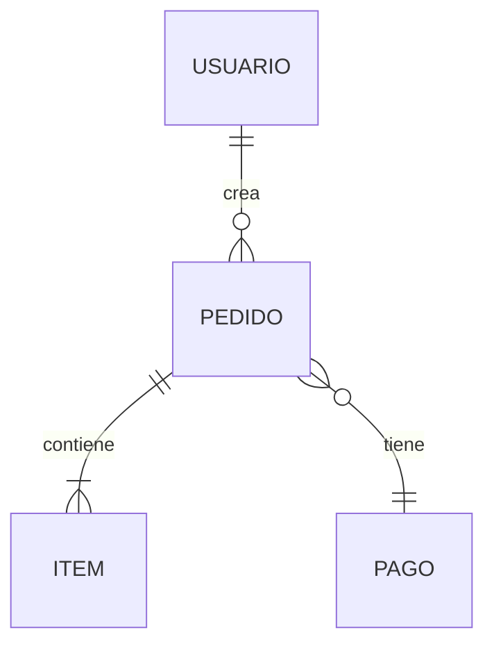

<div align="center">

# chronicle

**La crónica viva de tu proyecto.** Una skill que construye y mantiene una base de conocimiento estructurada — generándola desde documentos, desde cero, o **documentando código existente sin tocar una sola línea**.

[](LICENSE)
[](SKILL.md)
[](#regla-de-oro)

*Un cronista registra la realidad tal cual es, sin alterarla. Eso es chronicle: documenta el sistema, no lo modifica.*

</div>

---

## ¿Qué es?

`chronicle` toma cualquier proyecto y produce una **base de conocimiento navegable y consistente** en `knowledge-base/`, organizada en **10 slots canónicos** —un núcleo de 4 siempre presente + variables que se activan según el tipo de sistema— que cubren todo lo crítico: visión, datos, reglas, flujos, arquitectura y decisiones.

A diferencia de un generador de documentación de un solo uso, chronicle cubre el **ciclo de vida completo**: crea, documenta código que ya existe, actualiza sin destruir, y audita lo que se escribió antes.

```
proyecto/                          chronicle                  knowledge-base/
├── docs/        ──────────►   ┌──────────────┐   ──────►   ├── 01_vision_y_objetivos.md
├── src/pagos/                 │   5 modos +   │             ├── 04_modelos-apis/
├── src/stock/                 │  read-only    │             ├── 05_reglas-de-negocio/
└── package.json               └──────────────┘             └── 10_preguntas_abiertas.md
```

---

## Regla de oro

> **El código se LEE pero NUNCA se modifica.**
> El **código dice el QUÉ**, el **usuario dice el PORQUÉ**, y **nada se inventa**.

Toda ambigüedad o suposición que no pueda confirmarse va al nodo `09` (decisión inferida) o `10` (pregunta abierta), nunca documentada como un hecho. chronicle actúa como **notario** cuando documenta lo que existe, y solo como **consultor** cuando todavía no hay nada construido.

Este principio es lo que hace que la documentación sea **confiable**: no mezcla lo que el sistema hace con lo que alguien supone que hace.

---

## Características

- 🧭 **5 modos** que cubren todo el ciclo de vida de la documentación.
- 🔍 **Documentación inversa por funcionalidad** — documenta un corte vertical (checkout, pagos…) que cruza carpetas y lenguajes, leyendo el código en modo read-only.
- 🪶 **Eficiente en tokens** — detecta el stack desde los *manifests*, no leyendo el código; y carga solo los recursos que el modo activo necesita.
- 🧩 **Estructura adaptativa** — núcleo de 4 nodos + *profile* por tipo de sistema (web, API, CLI, móvil, SaaS, **librería/SDK**, **pipeline de datos**): un CLI no lleva RBAC, una librería documenta su API pública, un pipeline su DAG. Y los nodos crecen de archivo a carpeta según el tamaño.
- 🔀 **Merge no destructivo** — actualizar nunca pisa el trabajo previo válido.
- ✅ **Auditable** — score de completitud por nodo, consistencia cruzada y detección de contradicciones internas.
- 📊 **Diagramas Mermaid** nativos (ERD, secuencia, arquitectura).
- 🌐 **Multi-idioma** (es/en) — el idioma se **pregunta una vez** al inicio (no se adivina del repo) — y **gobernanza condicional** para equipos.

---

## Instalación

```bash
npx skills add https://github.com/3zequiel3/chronicle
```

La skill se carga automáticamente cuando pedís crear, documentar, actualizar o auditar una base de conocimiento.

---

## Los 5 modos

Un **router de intención** elige el modo tras un embudo de detección barato:

| Modo | Cuándo | Qué hace |
|------|--------|----------|
| **A · Ingest** | Hay `docs/` con fuentes | Genera la KB completa con **una sola pregunta** (el idioma); por lo demás fire-and-forget. |
| **B · Scratch** | No hay docs ni código | Actúa como **arquitecto + product manager**: pregunta, propone, itera. |
| **C · Reverse** | Hay código sin documentar | Documenta **una funcionalidad** leyendo el código (read-only). |
| **Update** | Ya existe `knowledge-base/` | **Merge no destructivo**; promueve nodos archivo→carpeta al crecer. |
| **Audit** | Querés validar la KB | Reporta completitud, consistencia y drift. **No genera, audita.** |

```text
# Ejemplos de invocación
"creá la base de conocimiento del proyecto"     → Mode A
"armemos la KB desde cero"                       → Mode B
"documentá la funcionalidad de checkout"         → Mode C
"actualizá la KB con la feature de devoluciones" → Mode Update
"auditá la base de conocimiento"                 → Mode Audit
```

---

## Cómo funciona — el embudo de detección

chronicle arranca barato y solo se vuelve caro cuando hace falta. **La situación se detecta; la intención se pregunta.**

```
Capa 0 · Huella del filesystem   →  stack (vía package.json/go.mod/…), dominios,
         (casi 0 tokens)            tamaño y modo — SIN leer código fuente.

Capa 1 · Confirmar + preguntar   →  muestra lo detectado y pregunta SOLO lo que
                                     ningún archivo puede saber (intención, trayectoria…).

Capa 2 · Lectura profunda        →  solo en Mode C, y solo de la funcionalidad pedida.
         (acotada)
```

Por eso documentar un proyecto gigante cuesta casi lo mismo que uno chico: nunca se lee el gigante entero, solo su huella y la rebanada que pediste.

---

## Estructura de la base de conocimiento

Los **10 slots canónicos** se clasifican en dos ejes ortogonales:

- **Núcleo vs variable** (qué nodos existen) — `01/02/09/10` son el núcleo (siempre); `03`-`08` los activa y encuadra el *profile* del tipo de sistema.
- **Mapas vs colecciones** (archivo vs carpeta) — **mapas** (`01`, `02`, `03`, `08`, `10`) se leen enteros → archivo único; **colecciones** (`04`, `05`, `06`, `07`, `09`) crecen y se navegan por unidad → archivo o carpeta según el tamaño.

> El árbol de abajo es el set completo (perfil `web_app`). En una librería, un CLI o un pipeline, algunos slots se omiten o se reencuadran.

```
knowledge-base/
├── README.md                      # índice + resumen ejecutivo
├── 01_vision_y_objetivos.md       # 🗺️ mapa
├── 02_descripcion_general.md      # 🗺️ mapa — stack, arquitectura, integraciones
├── 03_actores_y_roles.md          # 🗺️ mapa — RBAC, permisos
├── 04_modelos-apis/               # 📚 colección — modelos/ + contratos-api/ + ERD
├── 05_reglas-de-negocio/          # 📚 colección — un archivo por dominio (RN-XX)
├── 06_funcionalidades/            # 📚 colección — un archivo por épica (US-NNN)
├── 07_flujos-principales/         # 📚 colección — un archivo por flujo
├── 08_arquitectura_propuesta.md   # 🗺️ mapa — patrones, seguridad, env vars
├── 09_decisiones/                 # 📚 colección ADR — un archivo por decisión (DD-NN)
└── 10_preguntas_abiertas.md       # 🗺️ backlog — inconsistencias + dudas priorizadas
```

> En sistemas chicos, las colecciones empiezan como **un solo archivo** y se promueven a carpeta automáticamente cuando cruzan un umbral. No se infla estructura porque sí.

---

## Diseño destacado

**Corte vertical por funcionalidad.** En Mode C, documentar "pagos" escribe en paralelo cuatro archivos — uno en cada colección — siguiendo el flujo real en vez de la estructura de carpetas del código:

```
04_modelos-apis/modelos/pago.md   ·   05_reglas-de-negocio/pagos.md
06_funcionalidades/pagos.md        ·   07_flujos-principales/pagos-checkout.md
```

Cuatro diffs quirúrgicos en lugar de cuatro monolitos editados. La estructura de carpetas es el reflejo físico del enfoque por funcionalidad.

**Diagramas que se mantienen.** Donde corresponde, los nodos usan Mermaid:



---

## Extras opcionales

Según el dominio, chronicle agrega nodos extra con prefijo `1X_` que **complementan** los 10 canónicos, nunca los reemplazan:

| Extra | Se activa cuando… |
|-------|-------------------|
| `12_seguridad_compliance.md` | hay datos sensibles (PII, pagos) — gate por **tipo de dato** |
| `13_glosario.md` | conviene fijar el lenguaje ubicuo del dominio |
| `1X_tenancy.md` | el sistema es SaaS multi-tenant |

---

## Por qué esta estructura

- **Consistencia** — todo proyecto documentado comparte la misma forma → onboarding más rápido.
- **Trazabilidad** — el nodo `09` (ADR) obliga a documentar el porqué de cada decisión.
- **Visibilidad de huecos** — el nodo `10` hace explícitas las preguntas pendientes en vez de enterrarlas.
- **Lista para spec-driven development** — la KB sirve de input para flujos tipo OpenSpec; los tags `[MVP]`/`[Post-MVP]` permiten derivar un roadmap.
- **Mantenible en el tiempo** — gobernanza condicional, changelog y auditoría de consistencia.

---

## Contribuir

Las contribuciones son bienvenidas. Abrí un issue para discutir cambios grandes antes de un PR. La skill vive en `SKILL.md` (el contrato) y `assets/` (los recursos cargados bajo demanda).

---

## Licencia

[Apache-2.0](LICENSE) — proyecto original de Ezequiel González.
