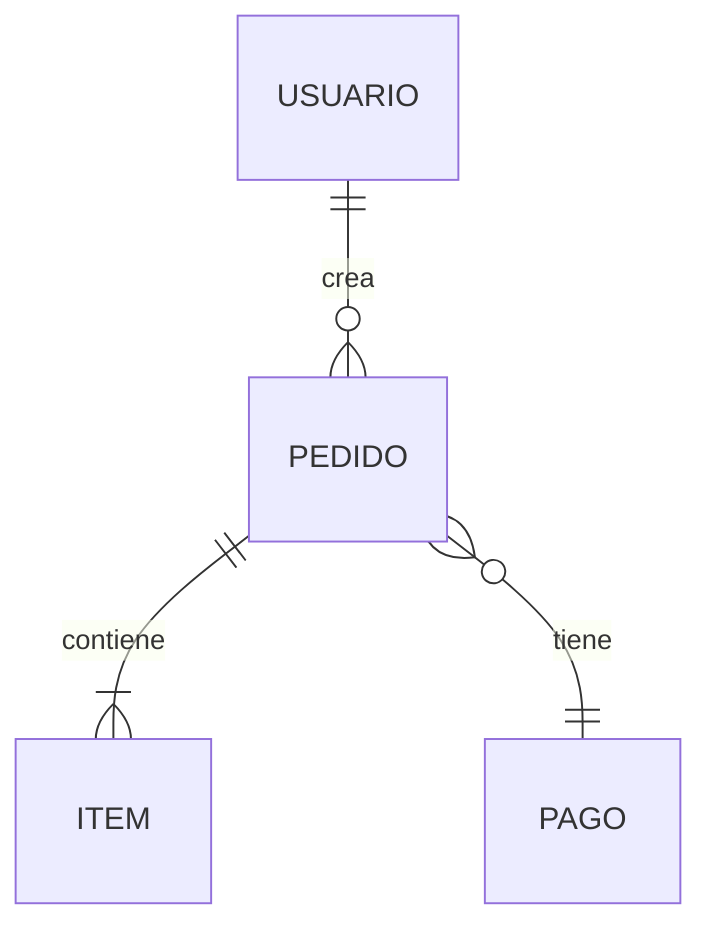
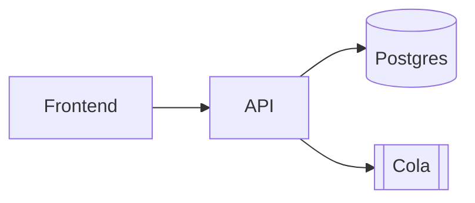

# Conventions & Adaptive Rules

Cross-cutting conventions that apply to all modes and nodes.

---

## 1. Diagrams in Mermaid (not ASCII)

Where a template calls for a diagram (ERD, sequence, architecture), use **Mermaid** — it renders natively in GitHub/GitLab and is easier to maintain than ASCII.

**ERD (node 04):**
````markdown

````

**Sequence (node 07):**
````markdown
```mermaid
sequenceDiagram
    Actor->>Frontend: inicia checkout
    Frontend->>API: POST /checkout
    API->>DB: reserva stock
    API-->>Frontend: confirmación
```
````

**Architecture (node 08):**
````markdown

````

ASCII only as a fallback if the target does not render Mermaid.

---

## 2. MVP / Post-MVP tagging (per item, not per file)

Each item in collections 05 (rules), 06 (stories), and 07 (flows) carries a scope tag:

```markdown
### US-007 — Checkout con pago real  `[Post-MVP]`
### US-003 — Carrito  `[MVP]`
```

Valid tags: `[MVP]`, `[Post-MVP]`, `[v2]` (or a concrete version). Why tagging instead of separate files: the KB documents ONE system; the MVP version of a feature and its post-MVP extension belong to the **same domain node**. Tags keep it filterable and allow deriving a roadmap index (e.g. a `CHANGES.md`). `01` sets the boundary at vision level (`Scope v{X.Y}` / `Out of scope`); tags propagate it item by item.

> **In Mode A/C**: the code does not carry roadmap intent → the MVP/Post-MVP tag is set by the **user**, or the item is left untagged and the doubt goes to `10`. Post-MVP items that do not yet exist in code are **never documented as implemented**.

---

## 3. Adaptive canonical set (gate: `system_type` → profile)

`system_type` selects a **profile** that adds and removes nodes. Do not force all 10 identically onto every system. **The profile table that decides which slot lives and how it is framed is the authority and lives in `node-templates.md` §Axis 1.** Here only a summary of intent by type:

| system_type | Profile intent |
|---|---|
| `web_app` | Full set (RBAC, UI flows, front-back contracts) |
| `api` | Removes screens; emphasizes API contracts in `04` |
| `cli` | **Removes** RBAC from `03` and web flows from `07`; adds "commands and arguments" |
| `mobile` | Navigation flows + offline state |
| `saas_multi_tenant` | **Adds** data isolation + tenancy model (extra `1X_tenancy.md`) |
| `library_sdk` | **Removes** actors/UI-flows; `04` is the **public API surface**, `08` adds versioning/compat |
| `data_pipeline` | **Removes** actors/UI-stories; `04` is **data contracts**, `06` is stages/jobs, `07` is the **DAG**, `08` adds orchestration |

Removed nodes are not generated as empty files: they are omitted and the omission is noted in the `README` index.

---

## 4. Conditional compliance (gate: data type, NOT governance)

If discovery detects **sensitive data** (PII, payments, health), generate the extra `12_seguridad_compliance.md`. This gate is **independent** of `maintenance_context` — it is decided by the data type, not team size.

```markdown
# Seguridad y Compliance

## Clasificación de datos
[Tabla: Dato → Clasificación (público/interno/PII/sensible) → Retención]

## Normativa aplicable
[GDPR / PCI-DSS / HIPAA según corresponda]

## Controles
- Cifrado en tránsito / reposo
- Auditoría (audit trail)
- Gestión de secretos
```

> In Mode A/C: what the code reveals (e.g. card fields, personal data) is documented as fact; what it does not reveal (is there a GDPR obligation?) goes to `10` as a question.

---

## 5. Glossary / ubiquitous language

Recommended extra `13_glosario.md` — a single place where each domain term means one thing. Key for onboarding and DDD.

```markdown
# Glosario — Lenguaje Ubicuo

| Término | Definición | Notas |
|---|---|---|
| Pedido | Orden de compra confirmada por un usuario | NO es lo mismo que "Carrito" |
| Carrito | Selección temporal previa a la confirmación | Se descarta a las 24h |
```

---

## 6. KB language — ASKED, not detected

The KB language (file names **and** content) is a high-impact, zero-cost-to-ask decision: getting it wrong means regenerating the entire KB. For this reason it is **not inferred from the repo** — a *Spanglish* project (code in English, comments and README in Spanish) gives an ambiguous signal, and guessing wrong is expensive.

**Ask explicitly, exactly once, before writing the first file name:**

```
Which language do you want the documentation in?
(a) Spanish   (b) English
```

The answer is **cached for the entire KB**. This is the only question asked **even in Mode A** (silent): it is a structural decision — like `system_type` — where a cheap question prevents the most expensive mistake. Once the language is set, apply it consistently to **file names and content**:

| es (default) | en |
|---|---|
| `04_modelos-apis/` | `04_models-apis/` |
| `05_reglas-de-negocio/` | `05_business-rules/` |
| `06_funcionalidades/` | `06_features/` |
| `07_flujos-principales/` | `07_main-flows/` |

The language is decided once at the start (by question) and maintained throughout the KB. Do not mix languages within the same KB.
