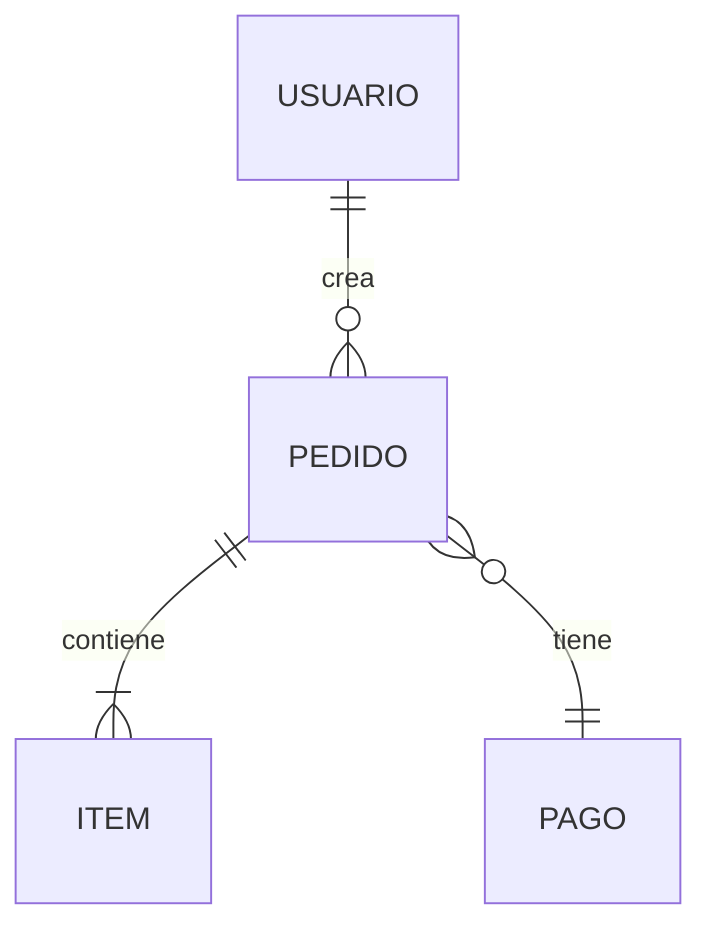
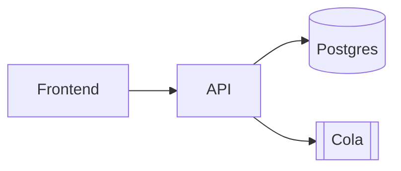

# Conventions & Adaptive Rules

Convenciones transversales que aplican a todos los modos y nodos.

---

## 1. Diagramas en Mermaid (no ASCII)

Donde un template pida un diagrama (ERD, secuencia, arquitectura), usá **Mermaid** — se renderiza nativo en GitHub/GitLab y se mantiene mejor que el ASCII.

**ERD (nodo 04):**
````markdown

````

**Secuencia (nodo 07):**
````markdown
```mermaid
sequenceDiagram
    Actor->>Frontend: inicia checkout
    Frontend->>API: POST /checkout
    API->>DB: reserva stock
    API-->>Frontend: confirmación
```
````

**Arquitectura (nodo 08):**
````markdown

````

ASCII solo como fallback si el destino no renderiza Mermaid.

---

## 2. Tagging MVP / Post-MVP (por ítem, no por archivo)

Cada ítem de las colecciones 05 (reglas), 06 (historias) y 07 (flujos) lleva un tag de alcance:

```markdown
### US-007 — Checkout con pago real  `[Post-MVP]`
### US-003 — Carrito  `[MVP]`
```

Tags válidos: `[MVP]`, `[Post-MVP]`, `[v2]` (o versión concreta). Por qué tagging y no archivos separados: la KB documenta UN sistema; la versión MVP de una feature y su extensión post-MVP pertenecen al **mismo nodo de dominio**. Los tags lo mantienen filtrable y permiten derivar un índice de roadmap (ej. un `CHANGES.md`). El `01` fija la frontera a nivel visión (`Alcance v{X.Y}` / `Fuera de alcance`); los tags la propagan ítem por ítem.

> **En Mode A/C**: el código no carga intención de roadmap → el tag MVP/Post-MVP lo pone el **usuario**, o el ítem queda sin tag y la duda va al `10`. Lo post-MVP que aún no existe en código **nunca se documenta como implementado**.

---

## 3. Set canónico adaptativo (gate: `system_type` → profile)

`system_type` selecciona un **profile** que agrega y quita nodos. No fuerces los 10 idénticos en todo sistema. **La tabla de profiles que decide qué slot vive y cómo se encuadra es la autoridad y vive en `node-templates.md` §Eje 1.** Acá solo el resumen de intención por tipo:

| system_type | Intención del profile |
|---|---|
| `web_app` | Set completo (RBAC, flujos UI, contratos front-back) |
| `api` | Quita pantallas; enfatiza contratos de API en el 04 |
| `cli` | **Quita** RBAC del 03 y flujos web del 07; agrega "comandos y argumentos" |
| `mobile` | Flujos de navegación + estado offline |
| `saas_multi_tenant` | **Agrega** aislamiento de datos + modelo de tenancy (extra `1X_tenancy.md`) |
| `library_sdk` | **Quita** actores/flujos-UI; el 04 es la **superficie de API pública**, el 08 suma versionado/compat |
| `data_pipeline` | **Quita** actores/historias-UI; el 04 son **data contracts**, el 06 son stages/jobs, el 07 es el **DAG**, el 08 suma orquestación |

Los nodos quitados no se generan vacíos: se omiten y se nota la omisión en el `README` index.

---

## 4. Compliance condicional (gate: tipo de dato, NO governance)

Si el discovery detecta **datos sensibles** (PII, pagos, salud), generá el extra `12_seguridad_compliance.md`. Este gate es **independiente** de `maintenance_context` — lo decide el tipo de dato, no el tamaño del equipo.

```markdown
# Seguridad y Compliance

## Clasificación de datos
[Tabla: Dato → Clasificación (público/interno/PII/sensible) → Retención]

## Normativa aplicable
[GDPR / PCI-DSS / HIPAA según corresponda]

## Controles
- Cifrado en tránsito / reposo
- Auditoría (audit trail)
- Gestión de secretos
```

> En Mode A/C: lo que el código revela (ej. campos de tarjeta, datos personales) se documenta como hecho; lo que no revela (¿hay obligación GDPR?) va al `10` como pregunta.

---

## 5. Glosario / lenguaje ubicuo

Extra recomendado `13_glosario.md` — un solo lugar donde cada término del dominio significa una cosa. Clave para onboarding y DDD.

```markdown
# Glosario — Lenguaje Ubicuo

| Término | Definición | Notas |
|---|---|---|
| Pedido | Orden de compra confirmada por un usuario | NO es lo mismo que "Carrito" |
| Carrito | Selección temporal previa a la confirmación | Se descarta a las 24h |
```

---

## 6. Idioma de la KB — se PREGUNTA, no se detecta

El idioma de la KB (nombres de archivo **y** contenido) es una decisión de alto impacto y costo de pregunta nulo: errar significa regenerar toda la KB. Por eso **no se infiere del repo** — un proyecto en *espanglish* (código en inglés, comentarios y README en español) da una señal ambigua, y adivinar mal sale carísimo.

**Preguntá explícitamente, una sola vez, antes de escribir el primer nombre de archivo:**

```
¿En qué idioma querés la documentación?
(a) Español   (b) English
```

La respuesta se **cachea para toda la KB**. Esta es la única pregunta que se hace **incluso en Mode A** (silencioso): es una decisión estructural —como `system_type`— donde una pregunta barata previene el error más caro. Una vez fijado el idioma, aplicalo de forma consistente a **nombres de archivo y contenido**:

| es (default) | en |
|---|---|
| `04_modelos-apis/` | `04_models-apis/` |
| `05_reglas-de-negocio/` | `05_business-rules/` |
| `06_funcionalidades/` | `06_features/` |
| `07_flujos-principales/` | `07_main-flows/` |

El idioma se decide una vez al inicio (por pregunta) y se mantiene en toda la KB. No mezclar idiomas dentro de una misma KB.
