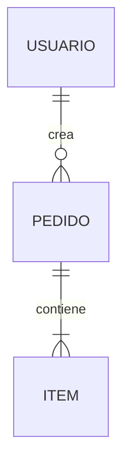

# Canonical Templates — estructura de cada nodo

Estructura **mínima esperada** de cada uno de los 10 nodos canónicos. Adaptala al dominio, pero respetá las secciones marcadas. Cada nodo incluye un **checklist de validación** que alimenta el completeness score (`quality-rubric.md`).

---

## Dos taxonomías ortogonales

Cada nodo se clasifica en dos ejes **independientes**:

1. **Núcleo vs variable** — *qué* nodos existen. Lo decide el `system_type` vía su **profile**.
2. **Mapa vs colección** — archivo único vs carpeta. Lo decide el **tamaño**.

Los dos ejes se combinan: un nodo puede estar activo (eje 1) y ser archivo o carpeta (eje 2).

---

## Eje 1 — Núcleo + profile por `system_type`

No todos los sistemas llevan los mismos nodos. Un CLI no tiene RBAC; una librería no tiene flujos de UI; un pipeline de datos no tiene historias de usuario. Forzar los 10 idénticos genera nodos vacíos o forzados. En cambio:

- **Núcleo (4 nodos, SIEMPRE presentes)** — aplican a cualquier sistema: **01** (visión), **02** (descripción/stack), **09** (decisiones), **10** (preguntas abiertas).
- **Variables (6 nodos, 03-08)** — su **presencia y encuadre** los define el profile del `system_type`. Un nodo que el profile desactiva **no se genera vacío**: se omite y se anota la omisión en el `README` index.

### Tabla de profiles (qué slot vive y cómo se encuadra)

| Slot | `web_app` | `api` | `cli` | `mobile` | `saas_multi_tenant` | `library_sdk` | `data_pipeline` |
|---|---|---|---|---|---|---|---|
| **03** actores | RBAC completo | auth de servicio | ✗ (el invocador) | RBAC completo | RBAC + roles de tenant | ✗ (consumidores de la API) | ✗ (operadores / upstreams) |
| **04** datos | entidades + contratos | énfasis en contratos de API | esquema de config/IO | entidades + sync | + aislamiento por tenant | **superficie de API pública** | **data contracts (in/out) + esquemas** |
| **05** reglas | reglas de dominio | reglas de dominio | semántica de comandos | reglas de dominio | + límites por plan | invariantes/contratos de comportamiento | reglas de transformación/validación |
| **06** funcionalidades | historias (US) | endpoints como features | **comandos y flags** | historias (US) | historias (US) | **recetas de uso de la API** | **stages / jobs del pipeline** |
| **07** flujos | flujos de UI | flujos de request | flujo de ejecución del comando | navegación + offline | flujos de UI | secuencias de llamada típicas | **DAG del pipeline / linaje de datos** |
| **08** arquitectura | completo | completo | completo | completo | + modelo de tenancy | + **versionado / compatibilidad** | + **orquestación / scheduling** |

> El profile se resuelve del `system_type` (detectado en Capa 0 / preguntado en P0-sys). La **selección** de profile no agrega tokens: cada run instancia **un solo profile**, y el asset-loading map ya carga solo lo necesario. `conventions.md` §3 encuadra el *tono* del interrogatorio por tipo; esta tabla decide *qué nodos existen*.

> **Extras gateados aparte** (no por profile): `12_seguridad_compliance.md` lo gatea el **tipo de dato** (PII/pagos), `1X_tenancy.md` lo agrega `saas_multi_tenant`. Ver `conventions.md` §3-4.

---

## Eje 2 — Mapas vs colecciones

De los nodos **activos**, solo las colecciones se explotan en carpeta.

- **Mapas (archivo único)** — se leen enteros para tener la foto completa; partirlos fragmenta la historia. Son **01, 02, 03, 08, 10**.
- **Colecciones (archivo o carpeta)** — listas de unidades discretas, organizadas por funcionalidad/dominio, que crecen y se navegan por unidad. Son **04, 05, 06, 07, 09**. Son exactamente los nodos que **Mode C escribe** al documentar una funcionalidad.

> **Procedencia obligatoria**: cada ítem factual de las colecciones (04-07) y cada decisión (09) lleva su **cita de origen** (`[code · …]` / `[doc · …]` / `[user]`), o se marca `[inferred · inferido → 10]`. Ver `provenance.md`. Los checklists de abajo la exigen.

### Regla archivo ↔ carpeta (condicional por tamaño)

Una colección **arranca como archivo** y se **promueve a carpeta** al cruzar un umbral. No infles estructura en sistemas chicos.

| Nodo | Umbral sugerido para explotar a carpeta |
|---|---|
| 04 modelo de datos | ≥ ~6-8 entidades, o si hay contratos de API |
| 05 reglas de negocio | ≥ ~20 reglas en ≥ 3 dominios |
| 06 funcionalidades | ≥ ~3 épicas con varias historias |
| 07 flujos | ≥ ~5 flujos con diagramas |
| 09 decisiones | ≥ ~5 decisiones (patrón ADR) |

### Estructura de carpeta

Mantiene el **prefijo numérico** y lleva un `README.md` con el **mapa/overview** — lo único que sí necesitás ver todo junto.

```
knowledge-base/
├── 04_modelos-apis/
│   ├── README.md            ← índice + ERD GLOBAL
│   ├── modelos/{entidad}.md
│   └── contratos-api/{dominio}.md
├── 05_reglas-de-negocio/
│   ├── README.md            ← índice de dominios
│   └── {dominio}.md         ← RN-{DOMINIO}-NN
├── 06_funcionalidades/{epica}.md (+ README)
├── 07_flujos-principales/{flujo}.md (+ README)
└── 09_decisiones/
    ├── README.md            ← índice + supuestos SU-NN
    └── DD-NN-{titulo}.md     ← un archivo por decisión (ADR)
```

> **Corte vertical (Mode C)**: documentar "pagos" escribe `pago.md` en 04, `pagos.md` en 05, 06 y 07 — cuatro diffs quirúrgicos en lugar de cuatro monolitos. La carpeta es el reflejo físico del enfoque por funcionalidad.

### Promoción dinámica (Mode Update)

Cuando un update hace que una colección-archivo cruce el umbral, la skill la **refactoriza a carpeta**: crea `0X_<nombre>/`, reparte por unidad, escribe el `README` con el mapa y **actualiza todas las referencias cruzadas**. Refactor de documentación, nunca de código.

### Nodo 09 — variante ADR

Se explota por **longevidad**, no por funcionalidad: un archivo por decisión (`DD-01-elegir-postgres.md`). Los supuestos (`SU-NN`), más livianos, viven en el `README` de la carpeta.

---

## 01 · Visión y Objetivos *(mapa)*

```markdown
# Visión y Objetivos

## Propósito
[Una frase + un párrafo de contexto: qué problema resuelve y para quién.]

## Objetivos por actor
| Actor | Objetivo principal | Objetivos secundarios |

## Alcance v{X.Y}
- [Qué SÍ hace el sistema en esta versión.]

## Fuera de alcance
- [Qué NO hace, explícito.]

## Métricas de éxito
[Cómo se mide que cumple su propósito. Recomendado.]
```
**Checklist**: propósito en 1 frase · rango explícito de alcance · fuera-de-alcance presente.

---

## 02 · Descripción General *(mapa)*

```markdown
# Descripción General

## Stack tecnológico
| Capa | Tecnología | Versión |
| Frontend | React + TS | 19 |
| Backend | FastAPI | 0.11x |
| Datos | Postgres + Redis | 16 / 7 |

## Arquitectura general
[Diagrama Mermaid (ver conventions.md) + justificación de alto nivel.]

## Integraciones externas
| Servicio | Propósito | Tipo (REST/webhook/SDK) |
```
**Checklist**: stack por capa · diagrama presente · integraciones listadas.

---

## 03 · Actores y Roles *(mapa)*

```markdown
# Actores y Roles

## Actores
| Actor | Descripción | Cómo interactúa |

## RBAC — matriz de permisos
| Rol | Recurso | C | R | U | D |

## Rutas públicas
- [Accesibles sin autenticación.]
```
**Checklist**: matriz RBAC completa · rutas públicas explícitas. *(Omitir en `system_type = cli`.)*

---

## 04 · Modelo de Datos + Contratos *(colección)*

```markdown
# Modelo de Datos

## ERD


## Entidad: {Nombre}   `[code · prisma/schema.prisma#{Nombre}]`
- Atributos (con tipo)
- Relaciones (con cardinalidad)
- Constraints / índices

## Contrato de API: {dominio}
[Por endpoint: método, path, request, response, errores.] `[code · src/api/{dominio}.route.ts#handler]`
```
**Checklist**: ERD presente · cada entidad con atributos+relaciones · contratos con request/response · **cita de origen por ítem**.

---

## 05 · Reglas de Negocio *(colección)*

```markdown
# Reglas de Negocio — {dominio}

Código único `RN-{DOMINIO}-NN` para trazabilidad.

- **RN-PAGOS-01** `[MVP]`: [regla] — [justificación] `[code · tests/payments.test.ts#"no aplica cupón dos veces"]`
- **RN-PAGOS-02** `[Post-MVP]`: ... `[code · src/payments/rules.ts#applyDiscount]` ⚠ sin test
```
Preferí citar el **test** cuando existe (evidencia más fuerte). Si la regla sale solo de la implementación, marcala `⚠ sin test` — el marcador se auto-limpia cuando se agrega el test.

**Checklist**: toda regla con código · tag MVP/Post-MVP · justificación donde no sea obvia · **cita de origen por regla** · marcador `⚠ sin test` donde aplique.

---

## 06 · Funcionalidades *(colección)*

```markdown
# Funcionalidades — Épica {N}: {nombre}

### US-001 — {título}  `[MVP]`
**Como** [actor] **quiero** [acción] **para** [beneficio].

**Criterios de aceptación**:
- [ ] CA-1  `[code · src/checkout/handler.ts#submit]`
**Reglas relacionadas**: RN-PAGOS-01
```
**Checklist**: historias en formato US-NNN · criterios de aceptación · enlace a reglas existentes · **cita de origen en criterios derivados**.

---

## 07 · Flujos Principales *(colección)*

```markdown
# Flujo: {nombre}

**Disparador**: [evento] · **Actor**: [quién inicia]

## Secuencia
```mermaid
sequenceDiagram
    Actor->>API: POST /checkout
    API->>DB: reserva stock
    API-->>Actor: confirmación
```

## Pasos (cita por salto)
1. [Componente] hace X `[code · src/checkout/handler.ts#submit]`
2. [Componente] hace Y `[code · src/stock/reserve.ts#reserve]`

## Casos de error
- [caso] → [manejo]
```
**Checklist**: disparador+actor · diagrama de secuencia · casos de error · **cita de origen por paso**.

---

## 08 · Arquitectura Propuesta *(mapa)*

```markdown
# Arquitectura Propuesta

## Patrones aplicados
| Patrón | Dónde | Por qué |

## Estructura de directorios
[árbol]

## Seguridad
- Autenticación / Autorización / Validación de input / Secrets

## Variables de entorno
| Variable | Descripción | Ejemplo | Sensible (Y/N) |
```
**Checklist**: patrones justificados · sección de seguridad · env vars con marca de sensibilidad.

---

## 09 · Decisiones y Supuestos *(colección ADR)*

```markdown
# DD-01 — {título}   `[user]`
**Decisión**: [qué se decidió]
**Contexto**: [por qué hubo que decidir]
**Alternativas**: [opciones evaluadas]
**Justificación**: [por qué esta]
**Trade-offs**: [qué se resigna]

---
# SU-01 — {título}   (en el README de la carpeta)
**Supuesto**: [...] · **Origen**: [...] · **Riesgo si es falso**: [...] · **Cómo validar**: [...]
```
**Checklist**: cada decisión con alternativas+trade-offs · supuestos con origen y forma de validar.

---

## 10 · Preguntas Abiertas *(backlog)*

```markdown
# Preguntas Abiertas

## Inconsistencias detectadas
### IN-01 — {título}
**A dice**: [...] · **B dice**: [...] · **Impacto**: [...] · **Resolución propuesta**: [...]

## Preguntas priorizadas
| Prioridad | Pregunta | Bloquea | Decisor |
```
**Checklist**: inconsistencias con impacto · preguntas con prioridad y decisor.

> **Backlog VIVO, no log.** Cuando una pregunta se resuelve, su respuesta **migra** a su nodo propio (decisión → `09`, regla → `05`, etc.) y la pregunta **se borra del `10`**. El historial de la resolución va al `CHANGELOG.md`, no acá. Así el `10` se achica al resolver y nunca se convierte en un cementerio de miles de líneas. Misma regla para los supuestos `SU-NN` del `09`.

---

## README de la KB *(índice)*

```markdown
# {Proyecto} — Base de Conocimiento

## Índice de nodos
| Nodo | Tipo | Contenido |
| [01_vision_y_objetivos.md](01_vision_y_objetivos.md) | archivo | ... |
| [04_modelos-apis/](04_modelos-apis/README.md) | carpeta | ... |

## Quick start para devs
1. Dominio → 01, 03 · 2. Datos → 04 · 3. Reglas → 05 · 4. Arquitectura → 02, 08 · 5. Implementar → 06, 07 · 6. Antes de codear → 10

## Resumen ejecutivo
[2-3 frases con lo más importante.]
```
> Si el `system_type` omitió un nodo (ej. RBAC en un CLI), anotá la omisión en el índice en vez de dejar un archivo vacío.
