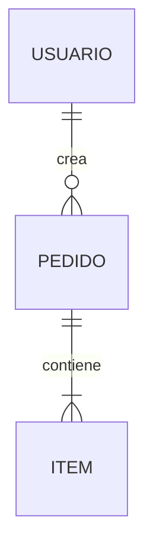

# Canonical Templates — structure of each node

**Minimum expected structure** for each of the 10 canonical slots (core + variables per profile — see §Axis 1). Adapt to the domain, but respect the marked sections. Each node includes a **validation checklist** that feeds the completeness score (`quality-rubric.md`). The base templates below are the `web_app` form; **non-web variants** (library, CLI, pipeline) are in §Templates by profile.

---

## Two orthogonal taxonomies

Each node is classified on two **independent** axes:

1. **Core vs variable** — *which* nodes exist. Decided by `system_type` via its **profile**.
2. **Map vs collection** — single file vs folder. Decided by **size**.

The two axes combine: a node can be active (axis 1) and be a file or folder (axis 2).

---

## Axis 1 — Core + profile by `system_type`

Not all systems carry the same nodes. A CLI has no RBAC; a library has no UI flows; a data pipeline has no user stories. Forcing all 10 identically generates empty or forced nodes. Instead:

- **Core (4 nodes, ALWAYS present)** — apply to any system: **01** (vision), **02** (description/stack), **09** (decisions), **10** (open questions).
- **Variables (6 nodes, 03-08)** — their **presence and framing** are defined by the `system_type` profile. A node deactivated by the profile **is not generated empty**: it is omitted and the omission is noted in the `README` index.

### Profile table (which slot lives and how it's framed)

| Slot | `web_app` | `api` | `cli` | `mobile` | `saas_multi_tenant` | `library_sdk` | `data_pipeline` |
|---|---|---|---|---|---|---|---|
| **03** actors | full RBAC | service auth | ✗ (the caller) | full RBAC | RBAC + tenant roles | ✗ (API consumers) | ✗ (operators / upstreams) |
| **04** data | entities + contracts | emphasis on API contracts | config/IO schema | entities + sync | + per-tenant isolation | **public API surface** | **data contracts (in/out) + schemas** |
| **05** rules | domain rules | domain rules | command semantics | domain rules | + per-plan limits | invariants/behavior contracts | transformation/validation rules |
| **06** features | stories (US) | endpoints as features | **commands and flags** | stories (US) | stories (US) | **API usage recipes** | **pipeline stages / jobs** |
| **07** flows | UI flows | request flows | command execution flow | navigation + offline | UI flows | typical call sequences | **pipeline DAG / data lineage** |
| **08** architecture | full | full | full | full | + tenancy model | + **versioning / compatibility** | + **orchestration / scheduling** |

> The profile is resolved from `system_type` (detected in Layer 0 / asked in P0-sys). **Profile selection** adds no tokens: each run instantiates **a single profile**, and the asset-loading map already loads only what's needed. `conventions.md` §3 frames the *tone* of the interview by type; this table decides *which nodes exist*.

> **Separately gated extras** (not by profile): `12_seguridad_compliance.md` is gated by **data type** (PII/payments), `1X_tenancy.md` is added by `saas_multi_tenant`. See `conventions.md` §3-4.

---

## Axis 2 — Maps vs collections

Of the **active** nodes, only collections expand into folders.

- **Maps (single file)** — read in full to get the complete picture; splitting them fragments the story. These are **01, 02, 03, 08, 10**.
- **Collections (file or folder)** — lists of discrete units, organized by functionality/domain, that grow and are navigated per unit. These are **04, 05, 06, 07, 09**. These are exactly the nodes that **Mode C writes** when documenting a functionality.

> **Mandatory provenance**: every factual item in collections (04-07) and every decision (09) carries its **origin citation** (`[code · …]` / `[doc · …]` / `[user]`), or is marked `[inferred · → 10]`. See `provenance.md`. The checklists below require it.

### File ↔ folder rule (conditional on size)

A collection **starts as a file** and is **promoted to a folder** when it crosses a threshold. Don't inflate structure for small systems.

| Node | Suggested threshold to expand to folder |
|---|---|
| 04 data model | ≥ ~6-8 entities, or if there are API contracts |
| 05 business rules | ≥ ~20 rules in ≥ 3 domains |
| 06 features | ≥ ~3 epics with several stories |
| 07 flows | ≥ ~5 flows with diagrams |
| 09 decisions | ≥ ~5 decisions (ADR pattern) |

### Folder structure

Keeps the **numeric prefix** and includes a `README.md` with the **map/overview** — the only thing you actually need to see all together.

```
knowledge-base/
├── 04_modelos-apis/
│   ├── README.md            ← index + GLOBAL ERD
│   ├── modelos/{entidad}.md
│   └── contratos-api/{dominio}.md
├── 05_reglas-de-negocio/
│   ├── README.md            ← domain index
│   └── {dominio}.md         ← RN-{DOMINIO}-NN
├── 06_funcionalidades/{epica}.md (+ README)
├── 07_flujos-principales/{flujo}.md (+ README)
└── 09_decisiones/
    ├── README.md            ← index + assumptions SU-NN
    └── DD-NN-{titulo}.md     ← one file per decision (ADR)
```

> **Vertical slice (Mode C)**: documenting "pagos" writes `pago.md` in 04, `pagos.md` in 05, 06 and 07 — four surgical diffs instead of four monoliths. The folder is the physical reflection of the functionality-first approach.

### Dynamic promotion (Mode Update)

When an update causes a collection-file to cross the threshold, the skill **refactors it to a folder**: creates `0X_<name>/`, distributes by unit, writes the `README` with the map and **updates all cross-references**. Documentation refactor, never code refactor.

### Node 09 — ADR variant

Expanded by **longevity**, not by functionality: one file per decision (`DD-01-elegir-postgres.md`). Assumptions (`SU-NN`), being lighter, live in the folder's `README`.

---

## 01 · Visión y Objetivos *(map)*

```markdown
# Visión y Objetivos

## Propósito
[One sentence + one context paragraph: what problem it solves and for whom.]

## Objetivos por actor
| Actor | Objetivo principal | Objetivos secundarios |

## Alcance v{X.Y}
- [What the system DOES in this version.]

## Fuera de alcance
- [What it does NOT do, explicit.]

## Métricas de éxito
[How you measure that it meets its purpose. Recommended.]
```
**Checklist**: purpose in 1 sentence · explicit scope range · out-of-scope present.

---

## 02 · Descripción General *(map)*

```markdown
# Descripción General

## Stack tecnológico
| Capa | Tecnología | Versión |
| Frontend | React + TS | 19 |
| Backend | FastAPI | 0.11x |
| Datos | Postgres + Redis | 16 / 7 |

## Arquitectura general
[Mermaid diagram (see conventions.md) + high-level justification.]

## Integraciones externas
| Servicio | Propósito | Tipo (REST/webhook/SDK) |
```
**Checklist**: stack per layer · diagram present · integrations listed.

---

## 03 · Actores y Roles *(map)*

```markdown
# Actores y Roles

## Actores
| Actor | Descripción | Cómo interactúa |

## RBAC — matriz de permisos
| Rol | Recurso | C | R | U | D |

## Rutas públicas
- [Accessible without authentication.]
```
**Checklist**: complete RBAC matrix · public routes explicit. *(Omit in `system_type = cli`.)*

---

## 04 · Modelo de Datos + Contratos *(collection)*

```markdown
# Modelo de Datos

## ERD


## Entidad: {Nombre}   `[code · prisma/schema.prisma#{Nombre}]`
- Attributes (with type)
- Relations (with cardinality)
- Constraints / indexes

## Contrato de API: {dominio}
[Per endpoint: method, path, request, response, errors.] `[code · src/api/{dominio}.route.ts#handler]`
```
**Checklist**: ERD present · each entity with attributes+relations · contracts with request/response · **origin citation per item**.

> **Extract, don't narrate**: if `schema.prisma`/`*.sql`/migrations or `openapi.*` exist, **extract** entities and contracts from there instead of narrating from memory (see `reverse-documentation.md` §Extract, don't narrate). The LLM adds only the WHY.

---

## 05 · Reglas de Negocio *(collection)*

```markdown
# Reglas de Negocio — {dominio}

Unique code `RN-{DOMINIO}-NN` for traceability.

- **RN-PAGOS-01** `[MVP]`: [rule] — [justification] `[code · tests/payments.test.ts#"no aplica cupón dos veces"]`
- **RN-PAGOS-02** `[Post-MVP]`: ... `[code · src/payments/rules.ts#applyDiscount]` ⚠ no test
```
Prefer citing the **test** when it exists (stronger evidence). If the rule comes only from the implementation, mark it `⚠ no test` — the marker self-clears when the test is added.

**Checklist**: every rule with a code · MVP/Post-MVP tag · justification where not obvious · **origin citation per rule** · `⚠ no test` marker where applicable.

---

## 06 · Funcionalidades *(collection)*

```markdown
# Funcionalidades — Épica {N}: {nombre}

### US-001 — {título}  `[MVP]`
**As** [actor] **I want** [action] **so that** [benefit].

**Acceptance criteria**:
- [ ] AC-1  `[code · src/checkout/handler.ts#submit]`
**Related rules**: RN-PAGOS-01
```
**Checklist**: stories in US-NNN format · acceptance criteria · link to existing rules · **origin citation in derived criteria**.

---

## 07 · Flujos Principales *(collection)*

```markdown
# Flujo: {nombre}

**Trigger**: [event] · **Actor**: [who initiates]

## Secuencia
```mermaid
sequenceDiagram
    Actor->>API: POST /checkout
    API->>DB: reserva stock
    API-->>Actor: confirmación
```

## Steps (citation per hop)
1. [Component] does X `[code · src/checkout/handler.ts#submit]`
2. [Component] does Y `[code · src/stock/reserve.ts#reserve]`

## Error cases
- [case] → [handling]
```
**Checklist**: trigger+actor · sequence diagram · error cases · **origin citation per step**.

---

## 08 · Arquitectura Propuesta *(map)*

```markdown
# Arquitectura Propuesta

## Patrones aplicados
| Pattern | Where | Why |

## Estructura de directorios
[tree]

## Seguridad
- Authentication / Authorization / Input validation / Secrets

## Variables de entorno
| Variable | Description | Example | Sensitive (Y/N) |
```
**Checklist**: justified patterns · security section · env vars with sensitivity flag.

---

## 09 · Decisiones y Supuestos *(ADR collection)*

```markdown
# DD-01 — {título}   `[user]`
**Decision**: [what was decided]
**Context**: [why a decision was needed]
**Alternatives**: [options evaluated]
**Rationale**: [why this one]
**Trade-offs**: [what is given up]

---
# SU-01 — {título}   (in the folder README)
**Assumption**: [...] · **Origin**: [...] · **Risk if false**: [...] · **How to validate**: [...]
```
**Checklist**: every decision with alternatives+trade-offs · assumptions with origin and validation method.

---

## 10 · Preguntas Abiertas *(backlog)*

```markdown
# Preguntas Abiertas

## Inconsistencias detectadas
### IN-01 — {título}
**A says**: [...] · **B says**: [...] · **Impact**: [...] · **Proposed resolution**: [...]

## Preguntas priorizadas
| Priority | Question | Blocks | Decision-maker |
```
**Checklist**: inconsistencies with impact · questions with priority and decision-maker.

> **LIVE backlog, not a log.** When a question is resolved, its answer **migrates** to its own node (decision → `09`, rule → `05`, etc.) and the question **is deleted from `10`**. The resolution history goes to `CHANGELOG.md`, not here. This way `10` shrinks as things are resolved and never becomes a graveyard of thousands of lines. Same rule for `SU-NN` assumptions in `09`.

---

## KB README *(index)*

```markdown
# {Project} — Knowledge Base

## Node index
| Node | Type | Content |
| [01_vision_y_objetivos.md](01_vision_y_objetivos.md) | file | ... |
| [04_modelos-apis/](04_modelos-apis/README.md) | folder | ... |

## Quick start for devs
1. Domain → 01, 03 · 2. Data → 04 · 3. Rules → 05 · 4. Architecture → 02, 08 · 5. Implement → 06, 07 · 6. Before coding → 10

## Executive summary
[2-3 sentences with the most important points.]
```
> If `system_type` omitted a node (e.g. RBAC in a CLI), note the omission in the index instead of leaving an empty file.

---

## Templates by profile (non-web variants)

The templates above are the `web_app` form. When the profile (§Axis 1) reframes a slot, **use the variant below instead of the base template** — same slot number, different form. Slots not listed for a profile use the base template; slots marked ✗ in the profile table are omitted. **Provenance is equally mandatory** (citation per item).

### `library_sdk`

- **04 · Public API surface** *(collection)* — replaces "data model". Per exported symbol:
  ```markdown
  ## `exportedFunction(args)` → ReturnType   `[code · src/index.ts#exportedFunction]`
  - **Signature**: parameters (type, optional/required), return, throws.
  - **Stability**: `stable` | `beta` | `deprecated` (+ since which version).
  - **Minimal example**: usage snippet.
  ```
  **Checklist**: every public symbol with signature · stability/semver · example · citation.
- **06 · Usage recipes** *(collection)* — replaces user stories. Per use case: goal, end-to-end snippet, notes/gotchas. `[code · …]`
- **07 · Call sequences** — the expected order of calls for a typical case (init → configure → use → release), with sequence diagram if applicable.
- **03 actors** and **07 UI flows**: ✗ (omit; consumers are not RBAC actors).

### `cli`

- **04 · Config/IO schema** — replaces entities: config files, env vars, input and output format (stdin/stdout/files), exit codes. `[code · …]`
- **06 · Commands** *(collection)* — replaces stories. Per command:
  ```markdown
  ## `my-cli <command> [flags]`   `[code · src/commands/cmd.ts#run]`
  - **Synopsis**: what it does in one sentence.
  - **Flags**: `--flag` (type, default, effect).
  - **Examples**: invocation → expected output.
  - **Exit codes**: 0 ok · N error.
  ```
- **07 · Execution flow** — from arg parsing to output/exit code.
- **03 RBAC**: ✗ (the caller is the user; there are no roles).

### `data_pipeline`

- **04 · Data contracts** *(collection)* — replaces entities. Per dataset/stream: schema (fields + types), format, source/sink, partitioning, SLA/freshness. `[code · …]`
- **06 · Stages / Jobs** *(collection)* — replaces stories. Per stage: input, transformation, output, idempotency/reprocessing. `[code · …]`
- **07 · DAG / lineage** — the dependency graph between stages + data lineage:
  ```markdown
  ## Pipeline DAG
  ```mermaid
  flowchart LR
      Ingesta --> Limpieza --> Enriquecido --> Carga
  ```
  - **Dependencies**: which stage waits for which.
  - **Lineage**: which source each output field comes from. `[code · …]`
  ```
- **03 actors** and **06 UI stories**: ✗ (operators/upstreams, not RBAC actors).

> `api`, `mobile` and `saas_multi_tenant` use the base templates with the profile table adjustments (emphasis on contracts, offline/sync, tenancy) — they don't need a full form variant.
